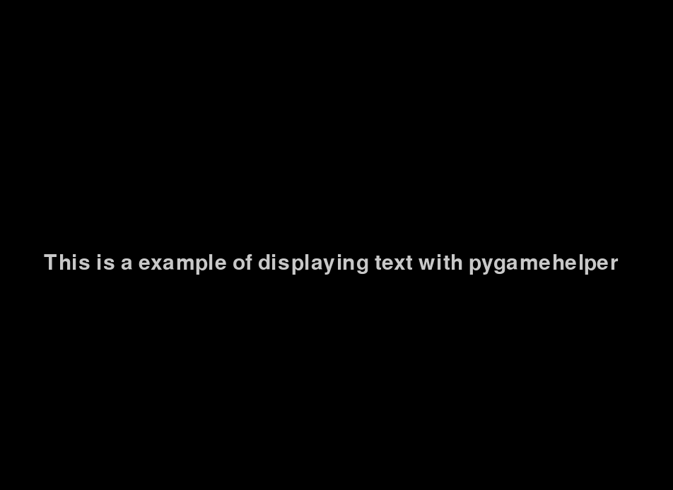

# pygamehelperguide
This is a guide for pygamehelper

# Displaying the text with pygamehelper
```python
#imports needed to use pygamehelper
import pygame
from pygamehelper import pygamehelper 

#initalizing pygame and pygame fonts
pygame.init()
pygame.font.init()

#Selecting the font and font size 
MAIN_FONT = pygame.font.SysFont("comicsans", 44)

#Setting up the window 
width, hight = 1000,1000
window = pygame.display.set_mode((width,hight))
#Setting up the title for the window
pygame.display.set_caption("pygamehelper example")
#Displaying the text with pygamehelper
pygamehelper.blit_text_center(window, MAIN_FONT, "This is a example of displaying text with pygamehelper ")
#updating the display
pygame.display.update()

#running the window and quiting
run = True
while run:
  for event in pygame.event.get():
    if event.type == pygame.QUIT:
      run = False

pygame.quit()      
```

# output of this code


# Scaling Images with pygamehelper
```python
#imports needed to use pygamehelper
import pygame
from pygamehelper import pygamehelper 

#initalizing pygame and pygame fonts
pygame.init()
pygame.font.init()


#Selecting the font and font size 
MAIN_FONT = pygame.font.SysFont("comicsans", 44)

#Setting up the window 
width, hight = 1000,1000
window = pygame.display.set_mode((width,hight))

#Setting up the title for the window
pygame.display.set_caption("pygamehelper example")

#Scaling the image with pygamehelper
EXAMPLE_IMAGE = pygamehelper.scale_image(pygame.image.load("example_image.png"), 2)

#drawing our image
window.blit(EXAMPLE_IMAGE, (500,500))      

#updating the display
pygame.display.update()

#running the window and quiting
run = True
while run:
  for event in pygame.event.get():
    if event.type == pygame.QUIT:
      run = False

pygame.quit()      
```
# Output of this code  

